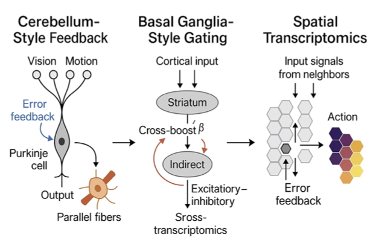

<p align="center">
  
</p>

# CereNet  
**A Cerebellum / Basal Ganglia–Inspired Tumor Coordination Model**

CereNet is an R package and workflow that…
– rapidly expands multi-omic signatures into high-dimensional features  
– uses biologically-inspired plasticity rules to learn which feature-mixes matter  
– produces interpretable risk scores and in silico “knock-out” simulations  

## Overview

CereNet identifies the most predictive combinations of multi-omic signatures by projecting raw feature matrices into a high-dimensional “granule” space via random projections and then applying a cerebellum-inspired, error-driven plasticity rule (Purkinje layer) to select those mixtures most tightly linked to your phenotype of interest.
It then aggregates those gated features in a “deep-nucleus” read-out to produce interpretable coordination scores and supports rapid in silico perturbations (e.g. channel knock-outs or temporal forecasting) to simulate and validate the impact of individual signals.

## Installation


CereNet is designed to be run on Unix-based operating systems such as macOS and Linux.

CereNet installation currently requires **remotes** and **BiocManager** for installing GitHub and Bioconductor packages. Run the following commands to install the various dependencies used by CereNet:

First, install remotes (for installing GitHub packages) if it isn’t already installed:

```r
if (!requireNamespace("remotes", quietly = TRUE)) {
  install.packages("remotes")
}
if (!requireNamespace("BiocManager", quietly = TRUE)) {
  install.packages("BiocManager")
}
remotes::install_github("deepabedi/CereNet", ref = "dev", repos = BiocManager::repositories(), upgrade = "never")


**Notes:**

- Installation should complete in under 2 minutes.  
- This package has been tested on R ≥ 4.2.0, macOS and Linux.  
- Other package dependencies can be found in the `DESCRIPTION` file.  


---

## Usage


## Usage

```r
# Load the package
library(CereNet)

# Run the quick-start vignette
browseVignettes("CereNet")


The vignette walks you through:

Preparing your mossy_data feature matrices

Running the granule → Purkinje → deep‐nucleus pipeline

Visualizing coordination scores and in silico knock-outs


